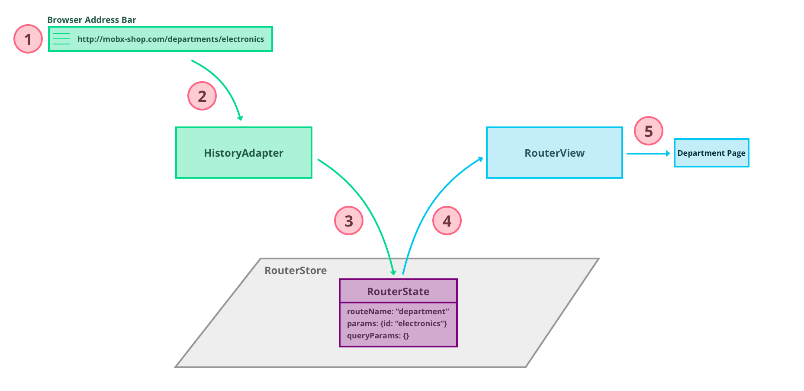
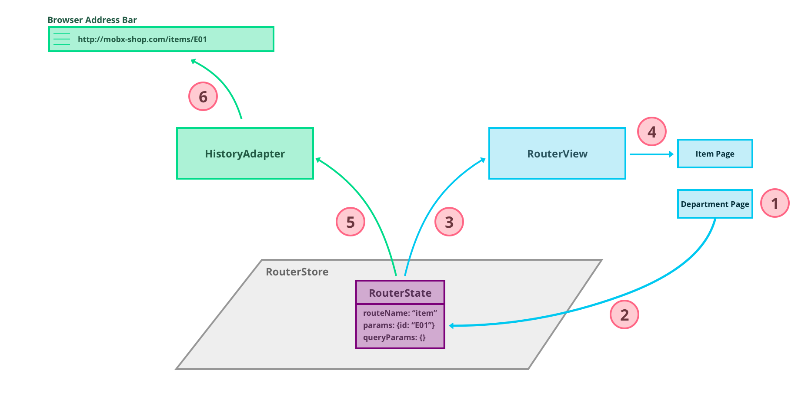

mobx-state-router
=================

[](https://github.com/prettier/prettier)
[](https://travis-ci.org/nareshbhatia/mobx-state-router)
[](https://coveralls.io/github/nareshbhatia/mobx-state-router?branch=master)

MobX-powered router for React apps.

Examples
--------
- MobX Shop:
[Live Demo](https://mobx-shop.firebaseapp.com),
[Source](https://github.com/nareshbhatia/mobx-shop.git)
- Server-Side Rendering: 
[SSR Boilerplate](https://github.com/xFloooo/mobx-state-router-ssr-boilerplate)

Table of Contents
-----------------
- [Features](#features)
- [Motivation](#motivation-decouple-state-and-ui)
- [Concepts](#concepts)
- [Getting Started](#getting-started)
- [Recipes](#recipes)
  - [Fetching Data](#fetching-data)
  - [Redirecting to the Sign In page](#redirecting-to-the-sign-in-page)
  - [Creating Links](#creating-links)
- [Troubleshooting](#troubleshooting)
- [API](#api)
- [Credits](#credits)


Features
--------
- State is decoupled from the UI. UI is simply a function of the state.
- UI is no longer responsible for fetching data. Data is now fetched during state transitions using router hooks.
- The router can override routing requests based on the application state. For example, it can redirect to the Sign In page if the user is not logged in.
- Supports
    - 404 (Not Found) errors
    - Server-Side Rendering


Motivation: Decouple State and UI
---------------------------------
The motivation to write mobx-state-router came from the frustration of dealing with subtle bugs in my code resulting from fetching data in `componentDidMount()`. Moreover, why should a component be responsible for fetching data in addition to rendering it? It feels like a violation of the [Single Responsibility Principle](https://en.wikipedia.org/wiki/Single_responsibility_principle). Looking for a better way, I came across this article by Michel Weststrate–[How to decouple state and UI](https://hackernoon.com/how-to-decouple-state-and-ui-a-k-a-you-dont-need-componentwillmount-cc90b787aa37). Here's an excerpt from the article which clearly describes the root cause of my problems:

> I discovered that most React applications are not driven by the state that is stored in stores; they are also driven by the logic in mounting components.
> - Interpreting route changes is often done in components; especially when using react-router. The router constructs a component tree based on the current URL, which fires of componentWillMount handlers that will interpret parameters and update the state accordingly.
> - Data fetching is often triggered by the fact that a component is about to be rendered, and kicked off by the componentWillMount lifecycle hook.

Michel then shows how to decouple state and UI, resulting in a robust architecture where components don't have to fetch data. They are purely a function of the application state stored in stores. Stores become more like a state machine, making it easy to follow the transitions of our application. mobx-state-router provides a first-class implementation of this idea.

My hope is that mobx-state-router will allow developers around the world to create more robust React applications with less headaches. If you like my work, please star the repo and refer it to your friends. Suggestions and PRs are welcome!


Concepts
--------
Before integrating mobx-state-router into your application, it's important to understand how it works. The section introduces you to the key concepts.

At the heart of it, mobx-state-router provides a `RouterStore` that stores the `RouterState`.


`RouterState` consists of 3 properties:

1. `routeName`: A string that defines the state of the router. For example, `"department"` in the e-commerce [Live Demo](https://mobx-shop.firebaseapp.com), Mobx Shop.
2. `params`: A set of key-value pairs that enhances the state. For example, `{id: "electronics"}` may signify that we are in the "department" state, but specifically in the "electronics" department.
3. `queryParams`: A second set of key-value pairs to further enhance the state. For example, `{q: "apple"}` may signify that we want to query for the string "apple".

As you may have guessed, this structure facilitates the decomposition of a URL into separate parts. However, from the router's viewpoint, this is simply application state that can be manipulated without any concerns about who is manipulating it (whether it's UI components or some other logic).

Now that we understand `RouterState`, let's move to the top-left of the diagram. The `HistoryAdapter`, which is responsible for translating the URL in the browser address bar to the router state and vice-versa. It is essentially an "observer" of the address bar and the router state.

Moving to the top-right, the `RouterView` watches the router state and instantiates the associated UI component. Finally, the UI components themselves can change the router state in reaction to user actions, such as keyboard entries and mouse clicks.

Now let's understand these concepts better by walking through two common scenarios. The first is when the user enters a URL in the browser address bar:



1. User enters a URL in the browser address bar, e.g. http://mobx-shop.com/departments/electronics.
2. `HistoryAdapter` notices the change and decomposes the URL into various parts.
3. `HistoryAdapter` stores the decomposed URL into the `RouterState`.
4. `RouterView` observes the change in `RouterState`.
5. `RouterView` looks up the view associated with the new router state and instantiates it.

The second scenario describes what happens when the user interacts with a view:



1. User clicks on an item on the Department page to see its details.
2. The department page changes the `RouterState` to the `item` route with the `id` parameter set to item `E01`.
3. `RouterView` observes the change in `RouterState`.
4. `RouterView` looks up the view associated with the `item` state and instantiates the Item page.
5. In parallel, the `HistoryAdapter` notices the change in `RouterState` and composes a URL from that state.
6. `HistoryAdapter` sets the composed URL in the browser address bar.

Hopefully, these scenarios gave you a good understanding of how mobx-state-router works. It's time to use it in a real app!


Getting Started
---------------
This section shows you how to get started with mobx-state-router in a real React app. If you don't have one to play with, create one using [create-react-app](https://github.com/facebookincubator/create-react-app). We also have a [finished example](https://github.com/nareshbhatia/mobx-state-router-quick-start) in Github, so if you get stuck, check out the working code there. If at any time you'd like to explore advanced concepts, feel free to look at the code for the advanced example called [MobX Shop](https://github.com/nareshbhatia/mobx-shop.git).

Note that mobx-state-router does not require you to switch all your state management to MobX. If you are already using other state management libraries (such as Redux), you can continue to use them, only the router will use MobX.

The first step is to install the router and its peer dependencies. If you already have one or more peer dependencies installed, you can leave them out.

    npm install --save mobx-state-router history react mobx mobx-react
    
Now let's define our routes, the `RouterStore` will need them. By convention we define our routes in [src/shared/stores/routes.js](https://github.com/nareshbhatia/mobx-state-router-quick-start/blob/master/src/shared/stores/routes.js). We will keep our routes configuration very simple for right now. Let's define three routes: `home`, `department` and `notFound`:

```jsx
// Routes are matched from top to bottom. Make sure they are sequenced
// in the order of priority. It is generally best to sort them by pattern,
// prioritizing specific patterns over generic patterns (patterns with
// one or more parameters). For example:
//     /items
//     /items/:id
export const routes = [
    {
        name: 'home',
        pattern: '/'
    },
    {
        name: 'department',
        pattern: '/departments/:id'
    },
    {
        name: 'notFound',
        pattern: '/not-found'
    }
];
```

Now let's create the `RouterStore`. We will use the [best practices](https://mobx.js.org/best/store.html#combining-multiple-stores) described in the MobX documentation to create our stores. According to this document, an effective way to structure your stores is to create a `RootStore` that instantiates all stores, and shares references. So let's create this `RootStore` that will instantiate the `RouterStore`. By convention, we define the `RootStore` in [src/shared/stores/root.store.js](https://github.com/nareshbhatia/mobx-state-router-quick-start/blob/master/src/shared/stores/root.store.js). Add the following code to this file to instantiate the `RouterStore`. Note that the `RouterStore` expects the `RootStore`, the routes and the `notFound` state as the parameters of its constructor.

```jsx
import { RouterState, RouterStore } from 'mobx-state-router';
import { routes } from './routes';

const notFound = new RouterState('notFound');

export class RootStore {
    routerStore = new RouterStore(this, routes, notFound);
}
```

Now that the `RouterStore` is ready, let's focus on the `HistoryAdapter`, which is the key component to keep the browser address bar in sync with the `RouterState`. The `HistoryAdapter` depends on the [history](https://github.com/ReactTraining/history) library to manage the browser history. It needs a history object in the constructor - let's create it. By convention, we create the history object in [src/shared/utils/history.js](https://github.com/nareshbhatia/mobx-state-router-quick-start/blob/master/src/shared/utils/history.js). Add the following code to your `history.js` file:

```jsx
import { createBrowserHistory } from 'history';

export const history = createBrowserHistory();
```

Now we are ready to connect all the pieces of the router architecture, namely the `RouterStore`, the `HistoryAdapter` and the `RouterView`. By convention, we do this in [src/App.js](https://github.com/nareshbhatia/mobx-state-router-quick-start/blob/master/src/App.js). If you are creating a new application, structure your `app.js` as follows, otherwise add the missing pieces to your existing `app.js`:

```jsx
import React, { Component } from 'react';
import { Provider } from 'mobx-react';
import { HistoryAdapter } from 'mobx-state-router';
import { RootStore } from './shared/stores/root.store';
import { history } from './shared/utils/history';
import { Shell } from './shell';

// Create the rootStore
const rootStore = new RootStore();

// Observe history changes
const historyAdapter = new HistoryAdapter(rootStore.routerStore, history);
historyAdapter.observeRouterStateChanges();

class App extends Component {
    render() {
        return (
            <Provider rootStore={rootStore}>
                <Shell />
            </Provider>
        );
    }
}

export default App;
```

Here we create an instance of the `RootStore` and give it to the MobX `Provider`. The `Provider` makes the `RootStore` (and hence the `RouterStore`) available in any view. We also create the `HistoryAdapter` and ask it to observe route changes. The final piece is the `RouterView` which will be created in the `Shell`. By convention, we create the `Shell` in [src/shell.js](https://github.com/nareshbhatia/mobx-state-router-quick-start/blob/master/src/shell.js). Add the following code to this file:

```jsx
import React from 'react';
import { inject } from 'mobx-react';
import { RouterView } from 'mobx-state-router';
import { DepartmentPage } from './features/department/department-page';
import { HomePage } from './features/home/home-page';
import { NotFoundPage } from './features/not-found-page';

const viewMap = {
    department: <DepartmentPage />,
    home: <HomePage />,
    notFound: <NotFoundPage />
};

class ShellBase extends React.Component {
    render() {
        const { rootStore: { routerStore } } = this.props;

        return (
            <div>
                <RouterView routerStore={routerStore} viewMap={viewMap} />
            </div>
        );
    }
}

export const Shell = inject('rootStore')(ShellBase);
```

Here we instantiate the `RouterView` in the `render()` method. We supply the `routerStore` as a prop along with a `viewMap`. The `RouterView` uses the `viewMap` to instantiate views based on the router state. Note that we are injecting the `rootStore` into the Shell using the MobX `inject` method. If you have enabled decorators as described in the [MobX docs](https://mobx.js.org/best/decorators.html#enabling-decorators), you can use the nicer decorator syntax as we have done in MobX Shop.

The final pieces of the puzzle are the pages themselves. Here's the code for them:

[src/features/home/home-page](https://github.com/nareshbhatia/mobx-state-router-quick-start/blob/master/src/features/home/home-page.js)

```jsx
import React from 'react';
import { inject } from 'mobx-react';

const styles = {
    root: {
        padding: 16
    }
};

class HomePageBase extends React.Component {
    render() {
        return (
            <div style={styles.root}>
                <h1>Home</h1>
                <button onClick={this.handleClick}>
                    Go to Electronics
                </button>
            </div>
        );
    }

    handleClick = () => {
        const { rootStore: { routerStore } } = this.props;
        routerStore.goTo('department', {id: 'electronics'});
    }
}

export const HomePage = inject('rootStore')(HomePageBase);
```

The home page has a button that allows the user to navigate to the Electronics department. Note the call to `routerStore.goTo()` to transition to the `department` state.

[src/features/department/department-page](https://github.com/nareshbhatia/mobx-state-router-quick-start/blob/master/src/features/department/department-page.js)

```jsx
import React from 'react';
import { inject } from 'mobx-react';

const styles = {
    root: {
        padding: 16
    }
};

class DepartmentPageBase extends React.Component {
    render() {
        const { rootStore: { routerStore } } = this.props;
        const { routerState: { params } } = routerStore;

        return (
            <div style={styles.root}>
                <h1>Welcome to {params.id}</h1>
                <button onClick={this.handleClick}>
                    Go Home!
                </button>
            </div>
        );
    }

    handleClick = () => {
        const { rootStore: { routerStore } } = this.props;
        routerStore.goTo('home');
    }
}

export const DepartmentPage = inject('rootStore')(DepartmentPageBase);
```

The department page has a button that allows the user to navigate to home. Note the call to `routerStore.goTo()` to transition to the `home` state.

[src/features/not-found-page](https://github.com/nareshbhatia/mobx-state-router-quick-start/blob/master/src/features/not-found-page.js)

```jsx
import React from 'react';

const styles = {
    root: {
        padding: 16
    }
};

export function NotFoundPage() {
    return (
        <div style={styles.root}>
            <h1>Page Not Found</h1>
        </div>
    );
}
```

Your React app is now ready for prime time! Point your browser to http://localhost:3000. You will see the home page. Click on the button to go to the Electronics department (watch the change in the URL). Now enter an invalid URL in the browser address bar, e.g. http://localhost:3000/junk. The router will automatically navigate to the not found page.

Now that you have a taste of the basics, you can try out some advanced scenarios. Look at the Recipes section below to explore.

Recipes
-------
### Fetching Data
As mentioned before, UI should not be responsible for fetching data. This means no data fetching in `componentWillMount()` or `componentDidMount()`. mobx-state-router facilitates data fetching during state transitions using the `onEnter` hook. This hook is called just before a new router state is entered and is the perfect place to kick off a data fetch. Here's [an example from MobX Shop](https://github.com/nareshbhatia/mobx-shop/blob/master/src/shared/stores/routes.js):

```jsx
{
    name: 'department',
    pattern: '/departments/:id',
    onEnter: (fromState, toState, routerStore) => {
        const { rootStore: { itemStore } } = routerStore;
        itemStore.loadDepartmentItems(toState.params.id);
        return Promise.resolve();
    }
},
```

This code is part of route definitions. We define an `onEnter` hook that calls `itemStore.loadDepartmentItems()` to kick off the fetching process. It does not have to wait for the fetch to complete. The `itemStore` maintains an `isLoading` flag to indicate the status of the fetch. The last line in the `onEnter` hook resolves the promise to let the router proceed to `toState`. 

### Redirecting to the Sign In page
If the user is not logged in, we can redirect them to a Sign In page. Not only that, we can redirect them back to the requested page on a successful sign in. For example, in MobX Shop, we allow the user to add items to the shopping cart without having them signed in. However they can't proceed to checkout unless they are signed in. This is achieved by using the `beforeEnter` hook in the route configuration. Here's [the code](https://github.com/nareshbhatia/mobx-shop/blob/master/src/shared/stores/routes.js) from MobX Shop:

```jsx
{
    name: 'checkout',
    pattern: '/checkout',
    beforeEnter: checkForUserSignedIn
}
```

`checkForUserSignedIn()` is a shared function used by multiple routes. It is defined in the [routes.js](https://github.com/nareshbhatia/mobx-shop/blob/master/src/shared/stores/routes.js) file:

```jsx
const checkForUserSignedIn = (fromState, toState, routerStore) => {
    const { rootStore: { authStore } } = routerStore;
    if (authStore.user) {
        return Promise.resolve();
    } else {
        authStore.setSignInRedirect(toState);
        return Promise.reject(new RouterState('signin'));
    }
};
```

This function allows the router to proceed if the user is already signed in. If not, the requested state is saved in the `authStore` and the app is redirected to the `signin` state. On a successful sign in, `authStore` redirects the app to the originally requested state. Here's [the code](https://github.com/nareshbhatia/mobx-shop/blob/master/src/shared/stores/auth.store.js) from MobX Shop:

```jsx
@action
setUser(user) {
    this.user = user;
    this.rootStore.routerStore.goTo(this.signInRedirect);
}
```

### Creating Links
You will notice that anchor tags used for linking to internal pages cause a flicker when clicked. That's because such links reload the entire app! We need to prevent the default handling of these links and let the router handle the redirect. This can be done using the `<Link>` component provided by the router. Here's an example of linking to the home page:

```jsx
import { Link, RouterState } from 'mobx-state-router';

function Footer({ routerStore }) {
    const toState = new RouterState('home');
    return (
        <div>
            <Link routerStore={routerStore} toState={toState}>
                Home
            </Link>
        </div>
    );
}
```

`<RouterLink>` is a simpler variation of `<Link>` that does not require the `routerStore` parameter. Also `toState` can be specified using simpler properties: `routeName`, `params` and `queryParams`. For example, the link shown above can be specified using `RouterLink` as follows:

```jsx
import { RouterLink } from 'mobx-state-router';

function Footer() {
    return (
        <div>
            <RouterLink routeName="home">
                Home
            </RouterLink>
        </div>
    );
}
```

Both `Link` & `RouterLink` accept `className` and `activeClassName` as optional properties. `className` is always applied to the generated anchor tag. `activeClassName` is applied in addition if the current `routerState` matches the state specified by the `RouterLink`. This feature is useful for highlighting the active link in a navbar.

Troubleshooting
---------------
To troubleshoot routing related issues, set the `NODE_ENV` environment variable to `development`. This will turn on the router logs and you will see exactly how the router's internal state is changing in the debugger console. Incidentally, if you are using create-react-app, `NODE_ENV` is automatically set to `development` during development.


API
---
mobx-state-router is written in TypeScript, with rich type information embedded right inside the code. When in doubt, look at the exported interfaces and classes - they are fairly easy to understand. In this section we highlight the key interfaces and classes.

### RouterState
`RouterState` consists of `routeName`, `params` and `queryParams`. Always use the constructor to create an instance of the `RouterState`. Once an instance is created, don't mutate it - create a fresh instance instead.

```jsx
export class RouterState {
    constructor(
        readonly routeName: string,
        readonly params: StringMap = {},
        readonly queryParams: Object = {}
    );
}
```

### Route
A `Route` consists of a name, a URL matching pattern and optional enter/exit hooks. The `RouterStore` is initialized with an array of routes which it uses to transition between states.

```jsx
export interface TransitionHook {
    (
        fromState: RouterState,
        toState: RouterState,
        routerStore: RouterStore
    ): Promise<void>;
}

export interface Route {
    name: string; // e.g. 'department'
    pattern: string; // e.g. '/departments/:id'
    beforeExit?: TransitionHook;
    beforeEnter?: TransitionHook;
    onExit?: TransitionHook;
    onEnter?: TransitionHook;
}
```

### RouterStore
The `RouterStore` is the keeper of the `RouterState`. It allows transitioning between states using the `goTo()` method.

```jsx
export class RouterStore {
    @observable.ref routerState: RouterState;
    @observable isTransitioning: boolean = false;

    constructor(rootStore: any, routes: Route[], notFoundState: RouterState, initialRoute: Route = INITIAL_ROUTE);
    goTo(toState: RouterState): Promise<RouterState>;
    goTo(routeName: string, params?: StringMap, queryParams?: Object): Promise<RouterState>;
    goToNotFound(): Promise<RouterState>;
    getRoute(routeName: string): Route;
    getCurrentRoute(): Route;
}
```

The `RouterStore` exposes two observable properties:
- routerState: the state of the router
- isTransitioning: set to true when the router is in the process of transitioning from one state to another. This property can be used, for example, to display a progress indicator during transitions.

### HistoryAdapter
The `HistoryAdapter` is responsible for keeping the browser address bar and the `RouterState` in sync. It also provides a `goBack()` method to go back in history.

```jsx
export class HistoryAdapter {
    constructor(routerStore: RouterStore, history: History);
    goToLocation = (location: Location): Promise<RouterState>;
    goBack();
}
```

### StaticAdapter
The `StaticAdapter` is responsible for driving `RouterState` programmatically instead of the Browser bar. This is useful in server-side rendering scenarios where the user isn’t actually clicking around, so the location never actually changes. Hence, the name `static`.

```jsx
export class StaticAdapter {
    constructor(routerStore: RouterStore);
    goToLocation = (location: Location): Promise<RouterState>;
}
```

### RouterView
The `RouterView` component watches the router state and instantiates the associated UI component. It expects two props: the `routerStore` and a `viewMap`. The `viewMap` is a simple mapping from `routeNames` to React components (or more generally `ReactNodes`).

```jsx
export interface ViewMap {
    [routeName: string]: React.ReactNode;
}

export interface RouterViewProps {
    routerStore: RouterStore;
    viewMap: ViewMap;
}

@observer
export class RouterView extends React.Component<RouterViewProps, {}> {...}
```

### Link
The `Link` component creates an anchor tag that links to a router state. Redirects to the target state without reloading the entire app, thus avoiding potential flickers.

`Link` accepts `className` and `activeClassName` as optional properties to control the look of the link in normal and active states.

```jsx
export interface LinkProps
    extends React.AnchorHTMLAttributes<HTMLAnchorElement> {
    routerStore: RouterStore;
    toState: RouterState;
    className?: string;
    activeClassName?: string;
}

export class Link extends React.Component<LinkProps, {}> {...}
```

You can pass other anchor tag attributes (such as onClick and onBlur) to this component. They will be passed through to the child anchor tag except for `href`, which is fully computed by this component.

See RouterLink for simpler way to create anchor tags.

### RouterLink
The `RouterLink` component is a simpler variation of `<Link>` that does not require the `routerStore` parameter. Also `toState` can be specified using simpler properties: `routeName`, `params` and `queryParams`.

`RouterLink` accepts `className` and `activeClassName` as optional properties to control the look of the link in normal and active states.

Note that the `rootStore` property is injected into the `RouterLink`. There is no need to supply it in your tags.

```jsx
export interface RouterLinkProps
    extends React.AnchorHTMLAttributes<HTMLAnchorElement> {
    rootStore?: any;
    routeName: string;
    params?: StringMap;
    queryParams?: Object;
    className?: string;
    activeClassName?: string;
}

export class RouterLink extends React.Component<RouterLinkProps, {}> {...}
```

You can pass other anchor tag attributes (such as onClick and onBlur) to this component. They will be passed through to the child anchor tag except for `href`, which is fully computed by this component.

Contributors
------------
When making a pull request, make sure that your commit messages conform to the [Angular Commit Message Conventions](https://github.com/angular/angular.js/blob/master/DEVELOPERS.md#-git-commit-guidelines). Doing so allows us to automate the whole package release workflow using [semantic-release](https://github.com/semantic-release/semantic-release).

To simplify this process, we have included [validate-commit-message](https://github.com/Frikki/validate-commit-message) and [Commitizen](https://github.com/commitizen/cz-cli) as dependencies of this project. To activate `validate-commit-message`, simply run the following command once in your local repo: `npm run activate-commit-hook`. From now on, you'll need to use `npm run commit` to commit to your repo. This will prompt you to fill out any required commit fields interactively.

Credits
-------
mobx-state-router is based on ideas from several Open Source projects. I am grateful to the developers of these projects for their contributions. Special thanks go to the following contributions: 

[How to decouple state and UI (a.k.a. you don’t need componentWillMount)](https://hackernoon.com/how-to-decouple-state-and-ui-a-k-a-you-dont-need-componentwillmount-cc90b787aa37)\
This article by [Michel Weststrate](https://twitter.com/mweststrate) provided the initial inspiration for writing mobx-state-router. It explains the downsides of mixing State and UI and how to untangle the mess!

[mobx-router](https://github.com/kitze/mobx-router)\
This library by [Kitze](https://github.com/kitze) is a good implementation of Michel Weststrate's ideas. I have borrowed some concepts from this implementation and then added my own. Thanks Kitze!

[router5](https://github.com/router5/router5)\
This is a more extensive library for routing. It's unique feature is that routes are organized as a tree, made of segments and nodes. It aims to be framework agnostic and uses middleware and plugins to adapt to different frameworks. Of course, with flexibility comes complexity. mobx-state-router makes some choices for you to keep the overall learning curve simple.
