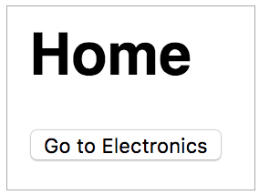

Welcome! We’re excited that you’ve decided to learn mobx-state-router. This
tutorial will guide you through building your first React app with
mobx-state-router.

The finished app will consist of two simple pages: Home (shown below) and
Electronics. Clicking the _Go to Electronics_ button on the Home page will take
you to the Electronics page. Clicking the _Go Home_ button on the Electronics
page will take you back to the Home page. That's it!



We have the
[finished example](https://github.com/nareshbhatia/mobx-state-router/tree/master/examples/quick-start)
in Github, so if you get stuck, check out the working code there.

## Create React App

Create a simple React app using
[create-react-app](https://github.com/facebookincubator/create-react-app).

```bash
npx create-react-app quick-start --template typescript
cd quick-start
```

## Install mobx-state-router

Install the router and its peer dependencies:

```bash
npm install --save mobx-state-router mobx mobx-react-lite
```

Note that mobx-state-router does not require you to switch all your state
management to MobX. If you are already using other state management libraries in
your app (such as Redux), you can continue to use them, only the router will use
MobX.

## Define Routes

Let's first define our routes. Create a file
[src/initRouter.ts](https://github.com/nareshbhatia/mobx-state-router/blob/master/examples/quick-start/src/initRouter.ts)
and add three routes to it: `home`, `department` and `notFound` as shown below:

```jsx
export const routes = [
    {
        name: 'home',
        pattern: '/',
    },
    {
        name: 'department',
        pattern: '/departments/:id',
    },
    {
        name: 'notFound',
        pattern: '/not-found',
    },
];
```

## Create RouterStore and HistoryAdapter

Now add code in the same file (`initRouter.ts`) to create the router and the
history adapter.

```jsx
import {
    browserHistory,
    createRouterState,
    HistoryAdapter,
    RouterStore,
} from 'mobx-state-router';

const notFound = createRouterState('notFound');

const routes = [
    // from above
];

export function initRouter() {
    const routerStore = new RouterStore(routes, notFound);

    // Observe history changes
    const historyAdapter = new HistoryAdapter(routerStore, browserHistory);
    historyAdapter.observeRouterStateChanges();

    return routerStore;
}
```

Note that `RouterStore` expects the routes and the `notFound` state as
constructor parameters.

The `HistoryAdapter` is responsible for keeping the browser address bar in sync
with the `RouterState`. It needs a
[history](https://github.com/ReactTraining/history) object to manage the browser
history. While you can create an instance yourself, mobx-state-router provides
one for your convenience - it's called `browserHistory`. Let's just use it.

## Create a viewMap

The `viewMap` is a simple structure that maps the routes to React components
(a.k.a. views). Let's map the three routes defined above to three views that we
will define later. Create a file
[src/viewMap.tsx](https://github.com/nareshbhatia/mobx-state-router/blob/master/examples/quick-start/src/viewMap.tsx)
and add the following `viewMap` to it:

```jsx
import React from 'react';
import { DepartmentPage, HomePage, NotFoundPage } from './pages';

export const viewMap = {
    department: <DepartmentPage />,
    home: <HomePage />,
    notFound: <NotFoundPage />,
};
```

## Provide routerStore to the React view hierarchy

Now we have the basic parts to assemble our application. Overwrite
[src/App.tsx](https://github.com/nareshbhatia/mobx-state-router/blob/master/examples/quick-start/src/App.tsx)
with the contents below to provide `routerStore` to the React view hierarchy.

```jsx
import React from 'react';
import { RouterContext, RouterView } from 'mobx-state-router';
import { initRouter } from './initRouter';
import { viewMap } from './viewMap';

export const App = () => {
    const routerStore = initRouter();

    return (
        <RouterContext.Provider value={routerStore}>
            <RouterView viewMap={viewMap} />
        </RouterContext.Provider>
    );
};
```

Here we give an instance of the `RouterStore` to `RouterContext.Provider`. While
you can create your own context, mobx-state-router gives you `RouterContext` for
your convenience. `RouterContext.Provider` now makes the `routerStore` available
to the entire view hierarchy below it.

In our case, the view hierarchy is created by the `RouterView` component, which
instantiates a UI component associated with the current router state. As the
router state changes, different components are instantiated based on the
mappings in the `viewMap`. The instantiated component (and its descendents) all
have access to the `routerStore`.

## Create Views

Now let's create the views that we specified in `viewMap`. Here's the code for
the three views:

[src/pages/HomePage.tsx](https://github.com/nareshbhatia/mobx-state-router/blob/master/examples/quick-start/src/pages/HomePage.tsx)

```jsx
import React from 'react';
import { useRouterStore } from 'mobx-state-router';

export const HomePage = () => {
    const routerStore = useRouterStore();

    const handleClick = () => {
        routerStore.goTo('department', {
            params: { id: 'electronics' },
        });
    };

    return (
        <div>
            <h1>Home</h1>
            <button onClick={handleClick}>Go to Electronics</button>
        </div>
    );
};
```

The home page has a button that allows the user to navigate to the Electronics
department. Note that we are using the `useRouterStore` hook to access the
RouterStore. Remember the RouterStore that was provided to the view hierarchy in
App.tsx? When the user clicks the _Go to Electronics_ button, we call
`routerStore.goTo()` to transition to the `department` route with parameter `id`
set to `electronics`.

[src/pages/DepartmentPage.tsx](https://github.com/nareshbhatia/mobx-state-router/blob/master/examples/quick-start/src/pages/DepartmentPage.tsx)

```jsx
import React from 'react';
import { useRouterStore } from 'mobx-state-router';

export const DepartmentPage = () => {
    const routerStore = useRouterStore();
    const { params } = routerStore.routerState;

    const handleClick = () => {
        routerStore.goTo('home');
    };

    return (
        <div>
            <h1>Welcome to {params.id}</h1>
            <button onClick={handleClick}>Go Home!</button>
        </div>
    );
};
```

The department page is very similar to the home page, the only difference is
that the _Go Home!_ button here calls `routerStore.goTo('home')`, navigating
back to the home page.

[src/pages/NotFoundPage.tsx](https://github.com/nareshbhatia/mobx-state-router/blob/master/examples/quick-start/src/pages/NotFoundPage.tsx)

```jsx
import React from 'react';

export const NotFoundPage = () => {
    return <h1>Page Not Found</h1>;
};
```

This page simply displays "Page Not Found".

[src/pages/index.ts](https://github.com/nareshbhatia/mobx-state-router/blob/master/examples/quick-start/src/pages/index.ts)

```jsx
export * from './DepartmentPage';
export * from './HomePage';
export * from './NotFoundPage';
```

This file exports all the pages in the `pages` folder for access from outside.

## Final Touches...

Overwrite
[src/index.tsx](https://github.com/nareshbhatia/mobx-state-router/blob/master/examples/quick-start/src/index.tsx)
with the simplified version below. The important bit is the named import for
`App` (just a preference).

```jsx
import React from 'react';
import ReactDOM from 'react-dom';
import { App } from './App';
import './index.css';

ReactDOM.render(
    <React.StrictMode>
        <App />
    </React.StrictMode>,
    document.getElementById('root')
);
```

Finally, overwrite
[src/index.css](https://github.com/nareshbhatia/mobx-state-router/blob/master/examples/quick-start/src/index.css)
with the version below. This provides the styling we need for our pages.

```css
body {
    margin: 0;
    padding: 16px;
    font-family: sans-serif;
}
```

## Start Your App

Your React app is now ready for prime time! Execute `npm start` on your command
line and point your browser to http://localhost:3000. You will see the home
page. Click on the button to go to the Electronics page (watch the URL change).
Now enter an invalid URL in the browser address bar, e.g.
http://localhost:3000/junk. The router will automatically navigate to the not
found page.

Now that you have a taste of the basics, you can try out some advanced
scenarios. Go to the Recipes section to explore. You can also look at the
[MobX Shop](https://github.com/nareshbhatia/mobx-state-router/tree/master/examples/mobx-shop)
example for a more realistic app.
