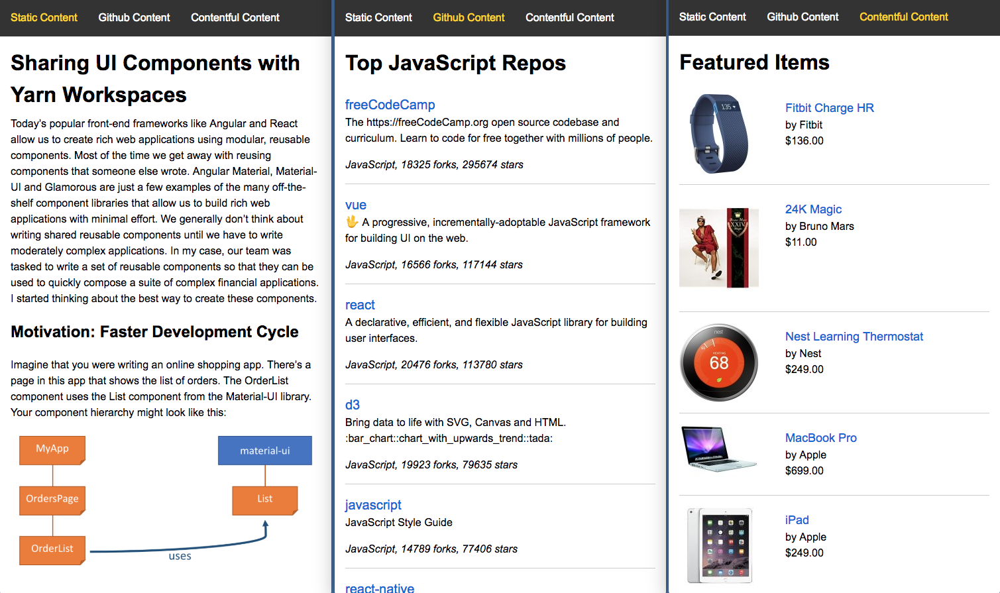

# Server-side Rendering (SSR)

**This example is work in progress. The client-side-rendering is working, but the server-side rendering is not working.**



Server-side rendering is a technique for rendering a single-page app on the
server and then sending the fully rendered page to the client. This is followed
by sending the app's CSS and JavaScript. Once the app receives the JavaScript,
it takes over the execution of the app. This gives the perception of a faster
page load and some SEO benefits. For a quick introduction to SSR, read
[this article](https://alligator.io/react/server-side-rendering/).

This example shows how server-side rendering can be implemented using
mobx-state-router. We have created a simple node server that accepts requests
for a single-page app. The request can come for any route, such as '/' or
'/github'. The server renders the requested route and returns the fully rendered
page to the client.

Here's how the server works (see `server/index.js`):

### Read index.html

The server first reads the `index.html` file that was created using the normal
build process. The file might look like this:

```
<html lang="en">
<head>
    <title>Server-Side Rendering</title>
    <link href="/static/css/main.cc9b9679.chunk.css" rel="stylesheet">
</head>
<body>
<div id="root"></div>
<script src="/static/js/1.ae776976.chunk.js"></script>
<script src="/static/js/main.0f6b6f30.chunk.js"></script>
</body>
</html>
```

Note that this file is practically empty - the client-side JavaScript is
expected to render the page and insert it inside `<div id="root"></div>`.
However, in case of SSR, the server is going to take over this process.

### Set the application state

Before rendering the page, the server needs to set the state of the application
based on the requested route. This will allow the application to render itself
based on the state. (As we all know, UI is a function of state!) So the server
first creates the `RootStore`, which in turn creates the `RouterStore`. It then
drives the state of the `RouterStore` using the `StaticAdapter`. We use the
`StaticAdapter` instead of the `HistoryAdapter` because there is no browser here
(so no history) and there will only be one route to render.

Note that initializing the router with the requested route will also load any
data that is required for the page.

### Render the page

Once the application's state is initialized, the server proceeds to render the
page. This is done by calling `ReactDOMServer.renderToString()`.

### Send the rendered page and the state to the client

Once the page is rendered, the server injects it into `index.html`. In addition,
it serializes the application state (`rootStore.serialize()`) and injects it
right after the `<body>` tag. This is super important. If we didn't do this, the
router on the client side would start from it's initial state and go through a
full transition to the requested route (including fetching fresh data). We don't
want to do this - the server has already done it. By sending the state and
letting the client initialize itself, we prevent the client-side router from
going through a full unnecessary transition.

Note that as part of the modified `index.html`, the CSS and JavaScript are also
sent down. However, since the JavaScript is sent after the HTML markup, the full
page is rendered even before the JavaScript starts loading.

The client-side JavaScript (`see src/index.js`) has been modified to first load
the application state sent by the server. Following that it calls
`ReactDOM.hydrate()` to attach event listeners to the existing markup sent by
the server. At this point the client starts executing as it would normally.

## CSR (client-side rendering) Build

```bash
$ yarn
$ yarn start
```

Now point your browser to http://localhost:3000/.

## SSR Build

**This part is work in progress. It is not working at the moment.**


```bash
$ yarn

# Build the client first
$ yarn build

# In shell 1, build the server (continuous build)
$ yarn build-server

# In shell 2, run the server (restarts server if build changes)
$ yarn ssr-start
```

Now point your browser to http://localhost:3000/.
