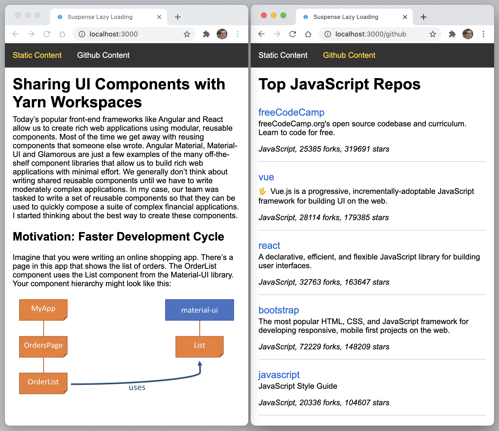

# Lazy Loading using React Suspense



This example shows how to lazy load pages using React Suspense. This is done in
`App.tsx` where pages are loaded lazily and rendered inside a `<Suspense>`
component. See
[React.lazy](https://reactjs.org/docs/code-splitting.html#reactlazy).

## Quick Start

```bash
yarn        # or npm install
yarn start  # or npm start
```

Now point your browser to http://localhost:3000/.
